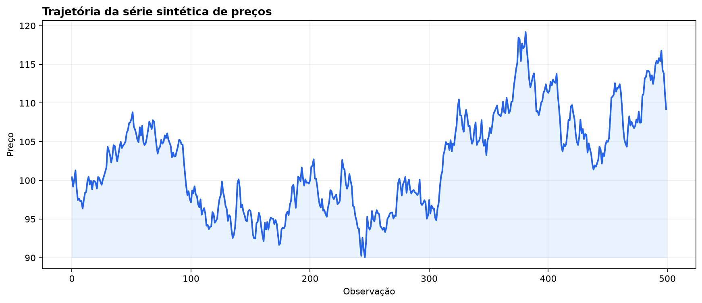
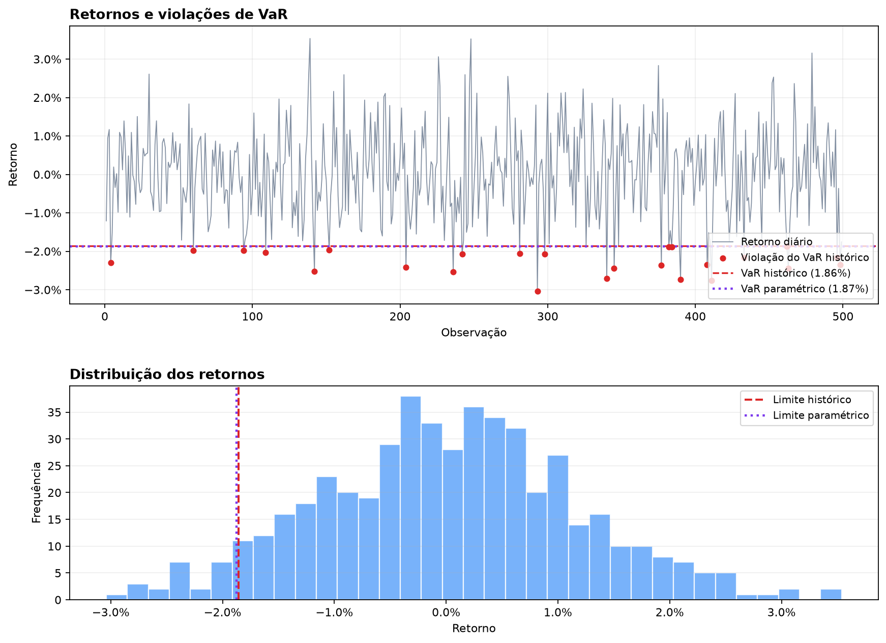

# Cálculo e Análise de Value at Risk

Projeto de portfólio em Python para calcular e comparar métodos básicos de Value
at Risk (VaR), com foco em risco de mercado, estatística e aplicações financeiras.

Esta primeira versão trabalha com **uma única série de preços ou retornos**. Ela
foi mantida propositalmente simples e serve como base para extensões futuras; não
calcula VaR de carteiras nesta etapa.

## Métodos implementados

- cálculo de retornos simples a partir de preços;
- VaR histórico;
- VaR paramétrico com distribuição normal;
- contagem simples de violações de VaR.

Os valores de VaR são apresentados como números não negativos: um VaR de `0.02`
representa uma perda potencial de 2%. Consulte a [metodologia](docs/methodology.md)
para uma explicação breve dos conceitos e limitações.

## Instalação

Requer Python 3.10 ou superior. Na raiz do projeto, crie e ative um ambiente
virtual e instale as dependências:

```bash
python -m venv .venv
```

No Linux ou macOS:

```bash
source .venv/bin/activate
```

No Windows:

```powershell
.venv\Scripts\Activate.ps1
```

Em seguida:

```bash
python -m pip install -r requirements.txt
```

## Executar o exemplo

O exemplo usa somente preços sintéticos e uma semente aleatória fixa. Não acessa
APIs nem baixa dados externos.

```bash
python examples/simple_var_demo.py
```

Para reproduzir os gráficos apresentados neste README:

```bash
python examples/generate_var_charts.py
```

## Executar os testes

```bash
pytest
```

## Estrutura do projeto

```text
calculo-analise-var/
├── README.md
├── requirements.txt
├── .gitignore
├── src/
│   ├── __init__.py
│   ├── returns.py
│   ├── var_methods.py
│   └── backtesting.py
├── examples/
│   ├── simple_var_demo.py
│   └── generate_var_charts.py
├── tests/
│   ├── test_returns.py
│   ├── test_var_methods.py
│   └── test_backtesting.py
└── docs/
    ├── methodology.md
    └── images/
        ├── synthetic_prices.png
        └── var_analysis.png
```

## Resultados e conclusão

Com a semente aleatória fixa do exemplo, foram obtidas 499 observações de retorno
e os seguintes resultados para 95% de confiança:

| Métrica | Resultado |
| --- | ---: |
| VaR histórico | 1,8589% |
| VaR paramétrico normal | 1,8729% |
| Violações do VaR histórico | 25 (5,01%) |





Os dois métodos produziram estimativas próximas, resultado coerente com a geração
de retornos por uma distribuição normal. O VaR histórico indica que, em condições
semelhantes às observadas, uma perda diária de aproximadamente 1,86% seria
excedida em cerca de 5% dos dias. As 25 violações correspondem a 5,01% da amostra,
valor próximo à taxa esperada para o nível de confiança adotado.

Essa leitura é apenas didática: o VaR foi estimado e avaliado na mesma amostra
sintética. Portanto, o resultado não constitui uma validação fora da amostra nem
garante desempenho futuro. Uma etapa posterior deverá usar previsões móveis e
testes formais de cobertura e independência, como Kupiec e Christoffersen.

## Próximos passos

- VaR de carteiras com múltiplos ativos;
- suporte a pesos de carteira;
- estimação e uso da matriz de covariância;
- VaR por simulação de Monte Carlo;
- Expected Shortfall;
- backtesting estatístico mais completo;
- visualizações e geração de relatórios.

Essas extensões serão feitas em etapas para preservar a clareza do código e
permitir a inclusão futura de métricas como a contribuição marginal de risco.
